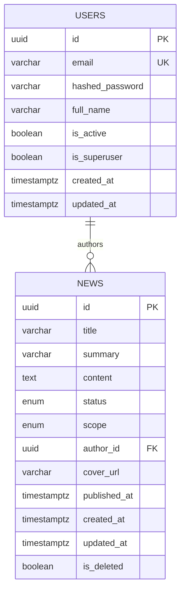

# Data Model

**Last updated**: 2026-02-09  
**Ticket**: NM-ADMIN-001-DB-T01

## Overview

This document describes the database schema for the GAIA application.

---

## Users

| Column | Type | Constraints | Description |
|--------|------|-------------|-------------|
| id | UUID | PK | Unique identifier |
| email | VARCHAR(255) | UNIQUE, NOT NULL, INDEX | User email address |
| hashed_password | VARCHAR(255) | NOT NULL | Bcrypt password hash |
| full_name | VARCHAR(255) | NULL | Display name |
| is_active | BOOLEAN | NOT NULL, DEFAULT TRUE | Account active flag |
| is_superuser | BOOLEAN | NOT NULL, DEFAULT FALSE | Admin privileges flag |
| created_at | TIMESTAMPTZ | NOT NULL | Row creation time |
| updated_at | TIMESTAMPTZ | NOT NULL | Last modification time |

---

## News

| Column | Type | Constraints | Description |
|--------|------|-------------|-------------|
| id | UUID | PK | Unique identifier |
| title | VARCHAR(255) | NOT NULL | Article headline |
| summary | VARCHAR(500) | NULL | Brief description for lists |
| content | TEXT | NULL | Rich text article body |
| status | ENUM(news_status) | NOT NULL, DEFAULT 'DRAFT' | DRAFT, PUBLISHED, ARCHIVED |
| scope | ENUM(news_scope) | NOT NULL, DEFAULT 'GENERAL' | GENERAL, INTERNAL |
| author_id | UUID | FK → users.id, NOT NULL | Creator reference |
| cover_url | VARCHAR(2048) | NULL | Cover image URL |
| published_at | TIMESTAMPTZ | NULL | When article was published |
| created_at | TIMESTAMPTZ | NOT NULL | Row creation time |
| updated_at | TIMESTAMPTZ | NOT NULL | Last modification time |
| is_deleted | BOOLEAN | NOT NULL, DEFAULT FALSE | Soft delete flag |

### Enums

**news_status**:
- `DRAFT` — Article is being written, not visible
- `PUBLISHED` — Article is live and visible per scope
- `ARCHIVED` — Article is hidden but preserved

**news_scope**:
- `GENERAL` — Visible to all users (public)
- `INTERNAL` — Only visible to members (RBAC enforced)

### Indexes

| Name | Columns | Purpose |
|------|---------|---------|
| ix_news_status | status | Filter by status |
| ix_news_scope | scope | RBAC queries |
| ix_news_is_deleted | is_deleted | Exclude soft-deleted |
| ix_news_published_at | published_at | Sort by date |
| ix_news_author_id | author_id | Author's articles |

---

## Entity Relationship Diagram

